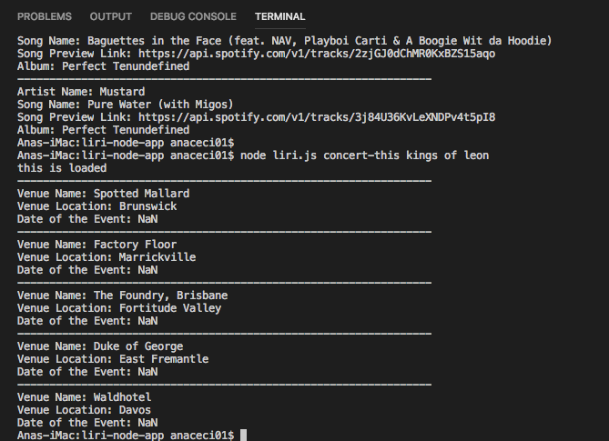
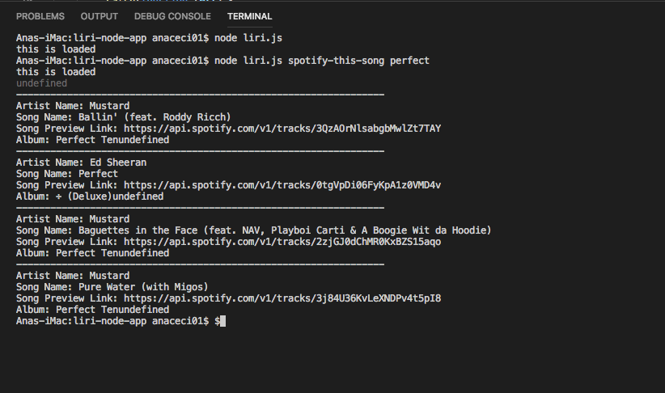
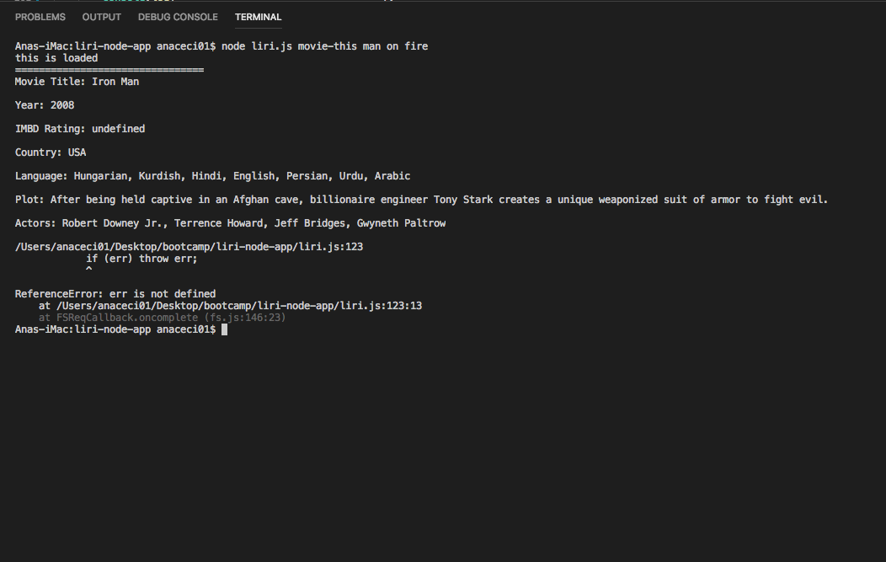
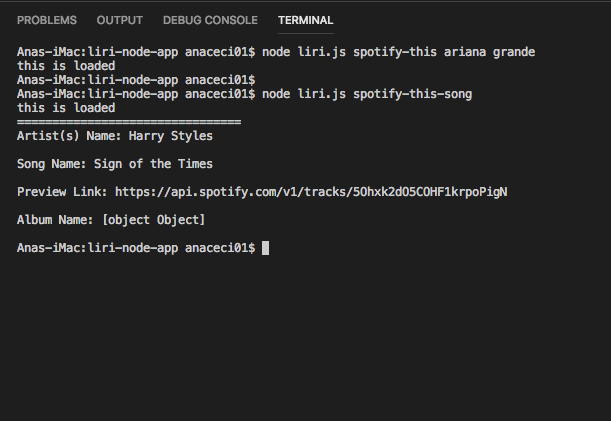
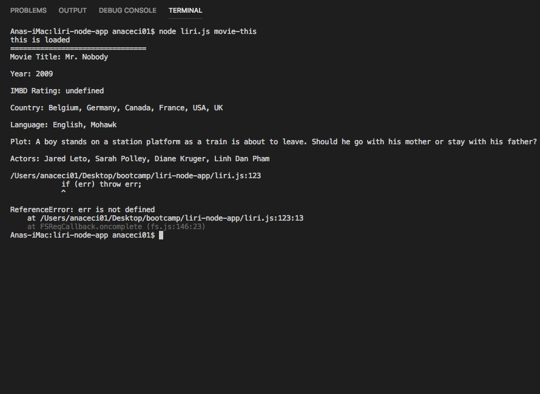

# Liri Node 
 
*Collaborators:* 
 
*Ana Davis* 
 
[link to liri-node repository!](https://anaceci01.github.io/liri-node-app/)

## About 
 
Liri is an app like iPhone's Siri, however, LIRI is a Language Interpretation and Recognition Interface, therefore LIRI is a command line node app which takes in parameters that will give you back data. The app will make use of Spotify API, BandsInTown API, and OMDB API 
## Index 
 
[Expected Outcome](#Expected-Outcome) 

 
### The LIRI Bot was designed to produce search results based on the following commands:
 
  * node liri.js concert-this
 
  * node liri.js spotify-this-song 
      
 
  * node liri.js movie-this 
      
 
  * node liri.js do-what-it-says
 

 ### The results produced from the search are as below:

  * node liri.js concert-this "artist/band name"
    * name of venue
    * venue location
    * date of event
  * node liri.js spotify-this-song "song/track name"
    * Artist
    * Song
    * Spotify song preview url
    * Album
  * node liri.js movie-this "movie title"
    * tile of the movie
    * year the movie came out
    * IMBD rating of the movie
    * country where the movie was produced
    * language of the movie
    * plot of the movie
    * actors in the movie
  * node liri.js do-what-it says
    * display the Spotify results for "I want it that way" stored in the random.txt file

## Code by Command

### concert-this

The use of concert-this was processed by using the Bands in Town API

### spotify-this-song
In order for spotify-this-song, we used Spotify API
    

### movie-this 
This command used the omdb API. An axios.get sent the search request and the results were console.logged.

### do-what-it-says

### movie-this-random

 [Back to top](#)

